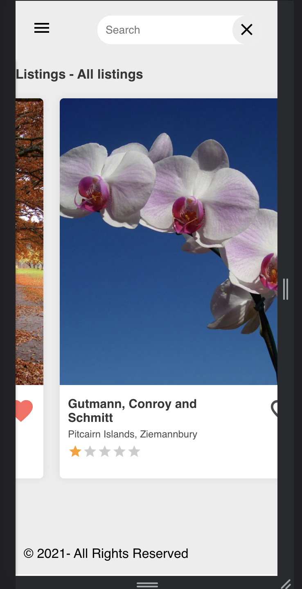
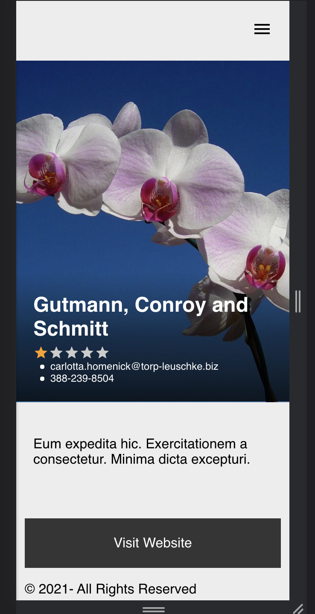

# Food Recipe App

## About

This project implements a simple food recipe SPA with data gotten from the test API of themealdb.com. The project is divided into two main sections:

## Home Section:

    Returns all natural views with their name, rating and location.

##### Some functionalities

- search a natural view using the search bar
- view details by selecting an image.
- Signup
- SignIn
- Create a new view
- Add favorite by clicking on the heart icon
- view all favorites

## favorite section:

    Returns All user's favorites

- The main functionality is to filter images by favorites

## Views

### Home View

### Image Detail page

## Built With

- React
- Redux

# Setup

[Clone App](https://github.com/nganifaith/Capstone-frontend).

- cd to React-Food-Recipe
- run `npm install`
- run `git checkout feature/api_calls`
- run `npm start` app opens on [http://localhost:3001](http://localhost:3001)

## Test

- run test `npm test`

### Prerequisites

- Knownledge of React
- JS API calls
- Redux
- React styled-components
- React Router

## Live site

[Live](https://fervent-sinoussi-2ae78f.netlify.app/)

## Author

👤 **Ngani Faith**

- GitHub: [@nganifaith](https://github.com/nganifaith)
- Twitter: [@Bright_Ngani](https://twitter.com/bright_ngani)
- LinkedIn: [Ngani Faith](https://www.linkedin.com/in/ngani-faith/)

## 🤝 Contributing

Contributions, issues, and feature requests are welcome!

Feel free to check the [issues page](https://github.com/nganifaith/Capstone-frontend/issues).

## Show your support

Give a ⭐️ if you like this project!

## 📝 License

This project is [MIT](./LICENSE) licensed
